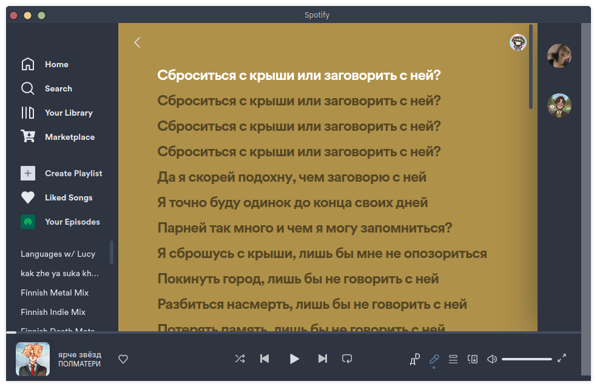
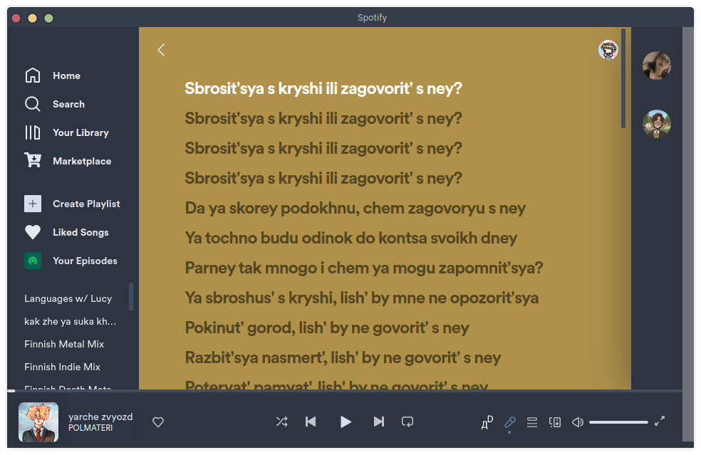

# Latinify
### Before  After 
How to install:
------
Linux/MacOS
```bash
git clone https://github.com/LucyUwI/latinify-spicetify.git 
cd latinify-spicetify
mv Latinfier.js ~/.config/spicetify/Extensions/
spicetify config extensions Latinfier.js
spicetify apply
```
Windows
```git clone https://github.com/LucyUwI/latinify-spicetify.git 
cd latinify-spicetify
mv Latinfier.js %appdata%\spicetify\Extensions\
spicetify config extensions Latinfier.js
spicetify apply
```

Works when you press the Д<sup>D</sup> Button to convert Cyrilic to Latin

#### If the Д<sup>D</sup> doesn't show up, reload discord, and if that doesn't work message me (Discord: Lucy#3030) Spotify has probably changed something
Cyrillic alphabets supported:
----------------------------
* Belarus
* Bulgaria
* Kazakhstan
* Kyrgyzstan
* Macedonia
* Mongolia
* Montenegro
* Russia
* Serbia
* Tajikistan
* Ukraine
